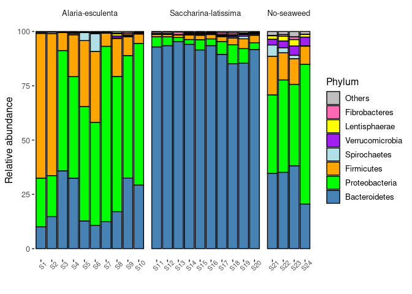
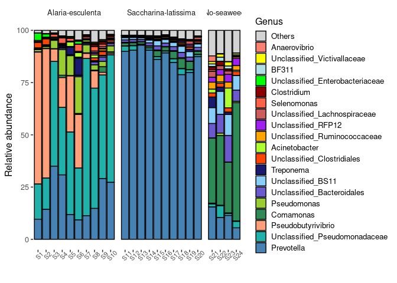
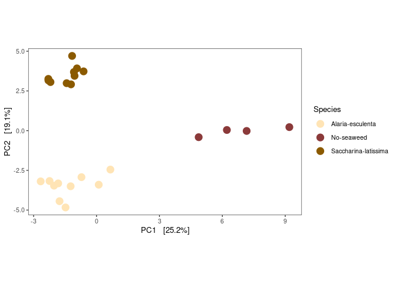
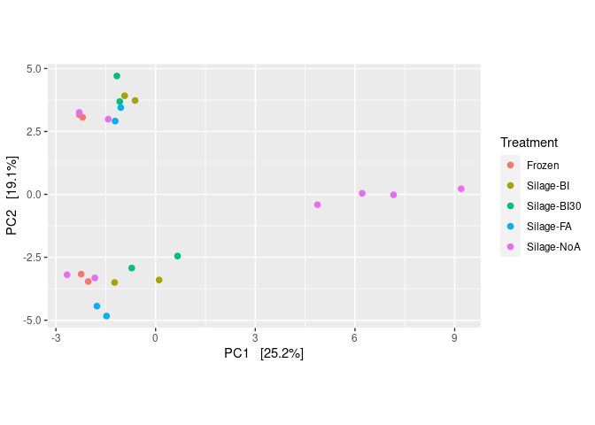
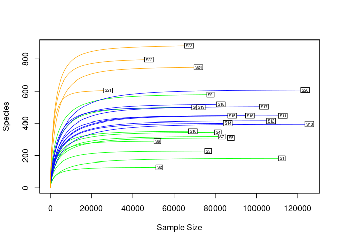
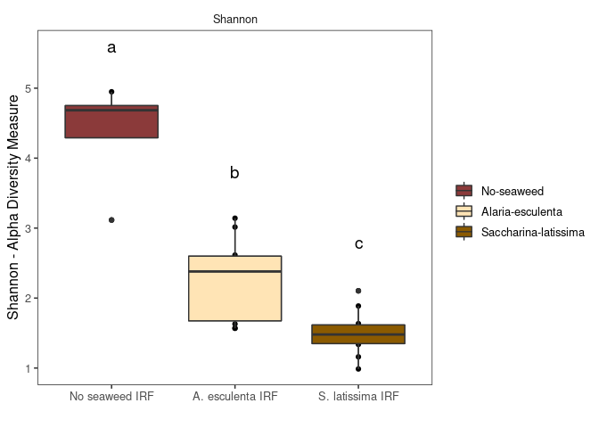
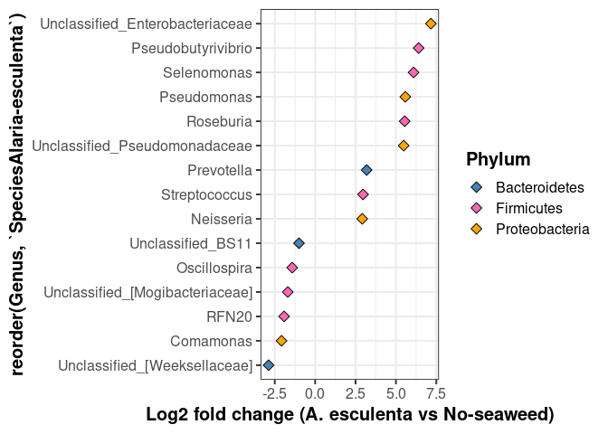

Rcode-microbiology
================
Sven Le Moine Bauer
2022-04-14

## Introduction

This is the R code for the microbial analysis of described in **Feed
characteristics and potential effects on ruminal bacteria of ensiled
Saccharina latis-sima and Alaria esculenta for dairy cows** from Yen *et
al.*, 2022. While we tried to make the code as clear as possible, we
have no pretension of being highly skilled R coders, and it is likely
that some sections could be rewritten in a more idiomatic manner. Any
comments are welcome. The code covers the following parts:

-   Preparation of the data
-   Barplots of the bacterial composition
-   Principal component analysis and associated statistical tests.
-   Rarefaction curves and Shannon diversity
-   Differential abundance analysis using ANCOM-BC and ALDEx2
-   Supplementary figures

The script is written so that the code of any section can be run once
the “Preparation of the data” section has been run.

## Preparation of the data

The data used here can be downloaded from the Github repository, and
contains 3 files:

-   “filtered_table.qza” is the OTU table produced through QIIME.
-   “taxonomy.qza” contains the taxonomic assignments to each OTU.
    Produced through QIIME.
-   The “ch2-sample-meta.tsv” file contains the metadata for each
    sample.

First we need load the libraries used here, and set up the working
directory.

``` r
library(qiime2R) # to import QIIME output files into R
library(phyloseq) # To be able to play with phyloseq objects
library(plyr) # To use the ddply function
library(ggplot2) # For plotting
library(compositions) # For the clr transformation
library(vegan) # For PERMANOVA analysis and rarefaction curves.
library(ANCOMBC)
library(ALDEx2)

# Set the directory to the one the script is saved in
setwd(dirname(rstudioapi::getActiveDocumentContext()$path)) 
```

And now let’s import the data. The code assumes that the files are in
the same directory than the script.

``` r
# Import the metadata to R
metadata <- read.csv("ch2-sample-meta.tsv", row.names = 1, sep = "\t")
# Make a phyloseq object out of the QIIME files
physeq1 <- qza_to_phyloseq( 
  features = "filtered_table.qza",
  taxonomy = "taxonomy.qza")
```

There is a certain amount of things that needs to be modified on these
files before doing the analysis.

``` r
# It is generaly not advised to keep sample names as numbers, so let's add "S" in front
otu <- as.data.frame(otu_table(physeq1)) # export the OTU table from phyloseq as data frame
otu <- otu[,order(as.numeric(colnames(otu)))] # Order the samples
colnames(otu) <- paste("S", colnames(otu), sep = "") # Paste "S" in front of each sample name
rownames(metadata) <- paste("S", rownames(metadata), sep = "") # Make the change in the metadata table too

# Let's remove Archaea from the dataset as they are not supposed to be targeted by the primer pair.
tax <- as.data.frame(tax_table(physeq1)) # export the taxonomy table from phyloseq as data frame
tax <- subset(tax, tax$Kingdom %in% "Bacteria") # Keep only Bacteria
otu<- subset(otu, row.names(otu) %in% row.names(tax)) # Subset the OTU table too

# While not mandatorily needed, it is also nicer to have proper OTU names rather than a nonsensical string.
identical(rownames(otu), rownames(tax)) # Checks if the order is same in the otu and tax tables. Has to be true!
```

    ## [1] TRUE

``` r
OTU_list <- paste("OTU_", c(1:1865), sep="") # Makes a list of new names
rownames(otu) <- OTU_list # Change the names to the otu table
rownames(tax) <- OTU_list # Change the names to the tax table

# We need to replace the NAs in the tax table by "Unassigned_XXX", otherwise we may have some nonsensical taxonomic amalgams later on.
tax[is.na(tax)] <- "" # Replaces NA by nothing.
for (i in 1:nrow(tax)){tax[i,] <- as.character(tax[i,])} # Make sure that everything is a string in the table
for (i in 1:nrow(tax)){
  if (tax[i,2] == ""){
    phylum <- paste("Unclassified_", tax[i,1], sep = "")
    tax[i, 2:7] <- phylum
  } else if (tax[i,3] == ""){
    class <- paste("Unclassified_", tax[i,2], sep = "")
    tax[i, 3:7] <- class
  } else if (tax[i,4] == ""){
    order <- paste("Unclassified_", tax[i,3], sep = "")
    tax[i, 4:7] <- order
  } else if (tax[i,5] == ""){
    family <- paste("Unclassified_", tax[i,4], sep = "")
    tax[i, 5:7] <- family
  } else if (tax[i,6] == ""){
    genus <- paste("Unclassified_", tax[i,5], sep = "")
    tax[i, 6:7] <- genus
  } else if (tax[i,7] == ""){
    species <- paste("Unclassified_", tax[i,6], sep = "")
    tax[i, 7] <- species
  }
}

# Some cleanup to finish
rm(physeq1, OTU_list, i, class, family, genus, order, phylum, species)
```

## Barplots of the microbial composition

This is the code leading to figure 2. First, we want to use relative
abundance, so let’s convert the OTU table.

``` r
# Change counts by relative abundance per sample
otu_rel <- prop.table(as.matrix(otu), margin = 2)*100

# Make a new phyloseq object
OTU_REL <- otu_table(otu_rel, taxa_are_rows = TRUE)
TAX <- tax_table(as.matrix(tax))
samples = sample_data(metadata)
Phyloseq_rel <- phyloseq(OTU_REL, TAX, samples)
```

A we want to have a barplot at the phylum level and another one at the
genus level, we need to do some amalgams.

``` r
Phyloseq_genus <- tax_glom(Phyloseq_rel, taxrank = "Genus")
Phyloseq_phylum <- tax_glom(Phyloseq_rel, taxrank = "Phylum")
```

### Phylum barplot

Now we are all set. Let’s start with the barplot at the phylum level.
When building a barplot, one needs to choose which taxa should be
represented, and which ones should be pulled together in an “Other”
category as they are less abundant in the communities. While this
separation is arbitrary, it should balance the importance of information
carried by the taxa and the readability of the plot. For our phylum
barplot, we decided to pull together all phyla that are not present in
more than 1% in at least 1 sample. That makes that 7 phyla remained,
plus the “Other” group.

Let’s start by pulling together the low abundance phyla.

``` r
# For that we need to get the phyloseq object into the long format, and make sure that phyla are strings.
phylum_distribution <- psmelt(Phyloseq_phylum)
phylum_distribution$Phylum <- as.character(phylum_distribution$Phylum)

phylum_max <- ddply(phylum_distribution, ~Phylum, function(x) c(max=max(x$Abundance))) # What is the highest abundance for each phylum?
phylum_others <- phylum_max[phylum_max$max < 1,]$Phylum # Get the list of phyla that do not reach 1% in any sample.
phylum_others_OTU <- row.names(tax_table(Phyloseq_phylum))[apply(tax_table(Phyloseq_phylum), 1, function(u) any(u %in% phylum_others))] # What is the OTU name of these phyla?
Phyloseq_phylum <- merge_taxa(Phyloseq_phylum, phylum_others_OTU) # Now we can pool these OTUs together inside the phyloseq object
```

Now it still needs a bit of polishing to be able to plot the data

``` r
phylum_distribution <- psmelt(Phyloseq_phylum) # ggplot also needs data in the long format
phylum_distribution$Phylum <- as.character(phylum_distribution$Phylum) # Makes sure that phyla are strings
phylum_distribution$Phylum[is.na(phylum_distribution$Phylum)] <- "Others" # Gives the name "Others" to the pulled phyla

# We want to have the phyla on the plot orgasnised from most abundant to least abundant, with "Others" as last.
phylum_total <- (ddply(phylum_distribution, ~Phylum, function(x) c(sum=sum(x$Abundance)))) # Cumulative abundance of each OTU.
phylum_total <- phylum_total[order(phylum_total$sum),] # Order the phyla per cumulative abundance
order_barplot <- phylum_total$Phylum #Get the list of ordered phyla
order_barplot <- c(order_barplot[3], order_barplot[1:2], order_barplot[4:8]) # Move "Others" to the beginning

# ggplot has a nasty habit to shuffle samples and stuff, so let's factorise the samples, and the phylum order.
phylum_distribution$Sample <- factor(phylum_distribution$Sample, levels = colnames(otu))
phylum_distribution$Phylum <- factor(phylum_distribution$Phylum, levels = order_barplot)

 # Make a color palette
cols <- c("grey","hotpink","yellow","purple","powderblue","orange","green","steelblue")
```

And finally, we can plot figure 2a! Note that some minor modification
have been made to the code to fit the markdown output format (eg. the
size variable)

``` r
ggplot(phylum_distribution, aes(x = Sample,
                                y = Abundance, 
                                fill = Phylum)) +
  geom_bar(stat="identity", colour = "black") +
  labs(x = "", y = "Relative abundance")+ 
  scale_fill_manual(values = cols)+
  facet_grid(~factor(sample_Species, levels=c("Alaria-esculenta", "Saccharina-latissima","No-seaweed")), scales = 'free', space = 'free')+
  theme_bw(base_size = 12)+
  theme(axis.text.x = element_text(angle = 45, size = 8))+
  theme(legend.position = "right", legend.text=element_text(size=10))+
  theme(panel.grid = element_blank(),
        strip.background = element_blank(),
        panel.border = element_blank()) + guides(fill=guide_legend(ncol = 1))
```

<!-- -->

### Genus barplot

The principle here is the same than for the phylum barplot, but this
time we decided to pull together all genera that are not present in more
than 1.6% in at least 1 sample. That makes that 19 genera kept, plus the
“Other” group.

Again, let’s start by pooling together the low abundance genera.

``` r
genus_distribution <- psmelt(Phyloseq_genus)
genus_distribution$Genus <- as.character(genus_distribution$Genus)
genus_max <- ddply(genus_distribution, ~Genus, function(x) c(max=max(x$Abundance)))
genus_others <- genus_max[genus_max$max < 1.6,]$Genus
genus_others_OTU <- row.names(tax_table(Phyloseq_genus))[apply(tax_table(Phyloseq_genus), 1, function(u) any(u %in% genus_others))]
Phyloseq_genus <- merge_taxa(Phyloseq_genus, genus_others_OTU)
```

The polishing part. Again, same as for the phylum plot.

``` r
genus_distribution <- psmelt(Phyloseq_genus)
genus_distribution$Genus <- as.character(genus_distribution$Genus)
genus_distribution$Genus[is.na(genus_distribution$Genus)] <- "Others"
genus_total <- (ddply(genus_distribution, ~Genus, function(x) c(sum=sum(x$Abundance))))
genus_total <- genus_total[order(genus_total$sum),]
order_barplot <- genus_total$Genus
order_barplot <- c(order_barplot[16], order_barplot[1:15], order_barplot[17:20])
genus_distribution$Sample <- factor(genus_distribution$Sample, levels = colnames(otu))
genus_distribution$Genus <- factor(genus_distribution$Genus, levels = order_barplot)
colg<-c("lightgrey","salmon","yellow","powderblue","green","darkred","tomato","indianred",
        "purple","orange","greenyellow","orangered","midnightblue","lightskyblue","slateblue",
        "yellowgreen", "seagreen","lightsalmon","lightseagreen","steelblue")
```

And the plot! This is figure 2b.

``` r
ggplot(genus_distribution, aes(x = Sample,
                               y = Abundance, 
                               fill = Genus)) +
  geom_bar(stat="identity", colour = "black") +
  labs(x = "", y = "Relative abundance")+ 
  scale_fill_manual(values = colg)+
  facet_grid(~factor(sample_Species, levels=c("Alaria-esculenta", "Saccharina-latissima","No-seaweed")), scales = 'free', space = 'free')+
  theme_bw(base_size = 12)+
  theme(axis.text.x = element_text(angle = 45, size = 8))+
  theme(legend.position = "right", legend.text=element_text(size=10), legend.key.size = unit(0.5, 'cm'))+
  theme(panel.grid = element_blank(),
        strip.background = element_blank(),
        panel.border = element_blank()) + guides(fill=guide_legend(ncol = 1))#Figure2B
```

<!-- -->

Let’s finish by cleaning the environment.

``` r
rm(genus_distribution, genus_max, genus_total, otu_rel, Phyloseq_genus, Phyloseq_phylum, Phyloseq_rel, phylum_distribution, phylum_max, phylum_total, colg, cols, genus_others, genus_others_OTU, order_barplot, OTU_REL, phylum_others, phylum_others_OTU, TAX, samples)
```

## PCA and associated statistical test

Due to the compositional characteristics of sequencing data, we use the
Aitchison distance for the PCA, i.e. the euclidian distance of clr
transformed data.

The first thing to do here is to replace the 0s of the dataset. So let’s
look how many 0s they actually are.

``` r
vec = unlist(otu)
mean(vec %in% "0") * 100
```

    ## [1] 75.5496

75% of 0s. That is a lot, but not uncommon in microbial datasets. [Lubbe
*et al.*,
2021](https://www.sciencedirect.com/science/article/pii/S0169743921000162)
suggest that for very sparce data the best way to replace 0s is to add a
pseudocount to each count. Most of the time 1 is used. So let’s do that,
and the clr transformation.

``` r
otu_no0s <- otu + 1 # Adds one to each count
otu_no0s_clr <- clr(otu_no0s) # Does the clr transformation

# And let's build a new phyloseq object with transformed data
OTUtable <- as.matrix(otu_no0s_clr)
taxtable <- as.matrix(tax)
OTU = otu_table(OTUtable, taxa_are_rows = TRUE)
TAX = tax_table(taxtable)
samples = sample_data(metadata)
phylo_clr <- phyloseq(OTU, TAX, samples)
```

And now we can get to the PCA plot, this is figure 3a.

``` r
# Run the PCA and scale the plot.
PCA_clr <- ordinate(phylo_clr, method = "RDA", distance = "euclidian")
clr1 <- PCA_clr$CA$eig[1] / sum(PCA_clr$CA$eig)
clr2 <- PCA_clr$CA$eig[2] / sum(PCA_clr$CA$eig)

plot_ordination(phylo_clr, PCA_clr, color = "Species") + 
  geom_point(size = 4) +
  scale_color_manual(values = c("moccasin", "indianred4", "orange4"))+
  coord_fixed(clr2 / clr1)+
  theme_bw(base_size = 10) +
  theme(panel.grid = element_blank(),
        strip.background = element_blank())#Figure3A
```

<!-- -->

Now let’s see if the groups are statistically different using PERMANOVA
analysis

``` r
clr_dist_matrix <- distance(phylo_clr, method = "euclidean") # Make a distance matrix
adonis(clr_dist_matrix ~ sample_data(phylo_clr)$Species) # Compute PERMANOVA
```

    ## 
    ## Call:
    ## adonis(formula = clr_dist_matrix ~ sample_data(phylo_clr)$Species) 
    ## 
    ## Permutation: free
    ## Number of permutations: 999
    ## 
    ## Terms added sequentially (first to last)
    ## 
    ##                                Df SumsOfSqs MeanSqs F.Model      R2 Pr(>F)    
    ## sample_data(phylo_clr)$Species  2     26044 13021.8  7.5766 0.41914  0.001 ***
    ## Residuals                      21     36092  1718.7         0.58086           
    ## Total                          23     62136                 1.00000           
    ## ---
    ## Signif. codes:  0 '***' 0.001 '**' 0.01 '*' 0.05 '.' 0.1 ' ' 1

Great, the p-value is at 0.001, so highly significant separation of the
3 groups. Nevertheless the test can be confounded by variation in
dispertion of each group, so let’s check that too.

``` r
dispr <- betadisper(clr_dist_matrix, sample_data(phylo_clr)$Species)
permutest(dispr)
```

    ## 
    ## Permutation test for homogeneity of multivariate dispersions
    ## Permutation: free
    ## Number of permutations: 999
    ## 
    ## Response: Distances
    ##           Df Sum Sq Mean Sq      F N.Perm Pr(>F)
    ## Groups     2  92.77  46.387 1.2324    999  0.318
    ## Residuals 21 790.45  37.641

No significant difference here (p-value = 0.317), so we are good!

Finally let’s plot the supplementary figure 1, and test for differences
between treatments.

``` r
plot_ordination(phylo_clr, PCA_clr, color = "Treatment") +   geom_point(size = 2) +
  coord_fixed(clr2 / clr1)
```

<!-- -->

``` r
clr_dist_matrix <- distance(phylo_clr, method = "euclidean")
adonis(clr_dist_matrix ~ sample_data(phylo_clr)$Treatment)
```

    ## 
    ## Call:
    ## adonis(formula = clr_dist_matrix ~ sample_data(phylo_clr)$Treatment) 
    ## 
    ## Permutation: free
    ## Number of permutations: 999
    ## 
    ## Terms added sequentially (first to last)
    ## 
    ##                                  Df SumsOfSqs MeanSqs F.Model      R2 Pr(>F)
    ## sample_data(phylo_clr)$Treatment  4     12830  3207.6  1.2361 0.20649  0.138
    ## Residuals                        19     49305  2595.0         0.79351       
    ## Total                            23     62136                 1.00000

No significant difference this time (p-value = 0.133).

``` r
rm(dispr, otu_no0s, OTUtable, PCA_clr, phylo_clr, taxtable, clr_dist_matrix, clr1, clr2, OTU, otu_no0s_clr, TAX, vec, samples)
```

## Rarefaction curves and Shannon diversity

First, we drew the rarefaction curves to estimate the richness of the
samples. This is supplementary figure 2.

``` r
# Start by making a phyloseq object
OTU = otu_table(otu, taxa_are_rows = TRUE)
TAX = tax_table(as.matrix(tax))
samples = sample_data(metadata)
phylo <- phyloseq(OTU, TAX, samples)

# And plot the rarefaction curves using the vegan package.
colours <- c(rep("Green", 10), rep("Blue", 10), rep("Orange", 4))
rarecurve(t(otu_table(phylo)), step=50, cex=0.5, col = colours)
```

<!-- -->

And now let’s look at the Shannon diversity index to draw Figure 3B.

``` r
sample_data(phylo)$Species<-factor(sample_data(phylo)$Species, c("No-seaweed", "Alaria-esculenta", "Saccharina-latissima")) # Factorise and organise the order of the feeds.
plot_richness(phylo, x="Species", measures= "Shannon") + geom_boxplot() + geom_boxplot(aes(fill=sample_data(phylo)$Species))+
  scale_fill_manual(values = c("indianred4", "moccasin", "orange4"))+
  theme_bw(base_size = 12) +
  annotate("text", x = "No-seaweed", y = 5.6, label = "a", size = 5)+
  annotate("text", x = "Alaria-esculenta", y = 3.8, label = "b", size = 5)+
  annotate("text", x = "Saccharina-latissima", y = 2.8, label = "c", size = 5)+
  labs(x = "", y = "Shannon - Alpha Diversity Measure")+
  scale_x_discrete(labels = c("No seaweed IRF", "A. esculenta IRF", "S. latissima IRF"))+
  theme(legend.title = element_blank())+
  theme(panel.grid = element_blank(),
        strip.background = element_blank())
```

<!-- -->
And the usual cleanup.

``` r
rm(phylo, samples, colours, OTU, TAX)
```

## Differential abundance analysis

Differential abundance analysis (DAA) is a controversial topic (See
[Quinn *et al.*, 2021](https://arxiv.org/abs/2104.07266v2)). While the
rational of DAA applied to compositional data itself is debated, one
other problem is that there are many DAA tools out there, with likely
the same amount of potential results (See [Nearing *et al.*,
2022](https://www.nature.com/articles/s41467-022-28034-z)). A way to
cope with this last issue is to run several algorithms and cross the
results. Here we used both ANCOM-BC and ALDEx2, which are 2 tools
respecting the compositional properties of sequencing data. Also, as
these tools look only at DA between 2 groups, we needed to run 3
different analysis: Alaria-NoSeaweed, Saccharina-NoSeaweed, and
Alaria-Saccharina. Here we show only the code for the Alraia-NoSeaweed
DAA, but the same code can easily be adapted for the 2 other analyses.

First of all it is advised to run such analysis only on the most
prevalent OTUs to have robust results. Here we will run the analysis a
the genus level, and select only the top 50 genera.

``` r
# Start by making a phyloseq object, and amalgaming at the genus level.
OTU = otu_table(otu, taxa_are_rows = TRUE)
TAX = tax_table(as.matrix(tax))
samples = sample_data(metadata)
phylo <- phyloseq(OTU, TAX, samples)
Phylo_genus <- tax_glom(phylo, taxrank = "Genus")

# Now let's take the 50 most abundant genera.
otu_rel <- prop.table(as.matrix(otu_table(Phylo_genus)), margin = 2)*100
otu_rel <- otu_rel[order(-rowMeans(otu_rel)),]
otu_tokeep <- rownames(otu_rel[c(1:50),])
Phylo_genus_50 <- prune_taxa(otu_tokeep, Phylo_genus)
```

Let’s start witht the ANCOM-BC analysis. While we kept some of the
default parameters, we also changed a couple of other ones. The “BH”
method was used for p_adjust as a more stringent way to avoid false
positives. zero_cut was set to 1 to not exclude any taxa from the
analysis. struc_zero was set to 1 to detect structural zeros, and
conserve was set to TRUE as advised when there are groups with small
amount of samples (like our No seaweed group).

``` r
# First let's factorise the feeds (species) so that No-seaweed is used as the base group.
sample_data(Phylo_genus_50)$Species <- factor(sample_data(Phylo_genus_50)$Species,
                                          levels = c("No-seaweed","Alaria-esculenta","Saccharina-latissima")) 
# And then run ANCOM-BC
out <- ANCOMBC::ancombc(phyloseq = Phylo_genus_50,
                        formula = "Species", p_adj_method = "BH", zero_cut = 1, group = "Species", struc_zero = TRUE, 
                        conserve = TRUE) 

#And extract the log2foldchange of the significantly differentialy abundant genera.
res <- as.data.frame(out$res$diff_abn)
res <- subset(res, `SpeciesAlaria-esculenta`== TRUE)
res_value <- as.data.frame(out$res$beta)
res_value <- subset(res_value, rownames(res_value) %in% rownames(res))
```

Now let’s run the ALDEx2 analysis. This one is not run on the phyloseq
object, but directly on the OTU table.

``` r
Aldotu <- as.data.frame(otu_table(Phylo_genus_50)) # Get out of phyloseq
Aldotu.sub <- Aldotu [,c(21:24, 1:10)] # Select only the relevant samples.
conds <- c(rep("NS", 4),rep("S", 10) ) # Creat a vector to assign each sample to the Non Seaweed or Seaweed group.

# Run ALDEx2
x.all.NA <- aldex(Aldotu.sub, conds, mc.samples=128, test='t',
                  effect=TRUE, include.sample.summary=FALSE, denom="all", verbose=FALSE) 
#Select genera with an effect <-1 or >1
x.NA <- dplyr::filter(x.all.NA, effect >1 | effect < -1)
```

And now that we have the results of the 2 different DAA we can select
genera that are only selected by both.

``` r
Merged <- merge(res_value, x.NA, by = 0, all = TRUE) # Combine both DAA results
rownames(Merged) <- Merged$Row.names # Give good row names again
Merged <- merge(Merged, as.data.frame(tax_table(Phylo_genus_50)), by = 0, all.y = FALSE) # Add taxonomy
rownames(Merged) <- Merged$Row.names # Give good row names again
Merged <- Merged[, c(3,10, 17,21)] # Select only the columns we need
Merged <- Merged[complete.cases(Merged),] # Select only the genera selected by both approaches
```

And finally get to the plot figure 4.

``` r
# Make the palette for the phyla
length(unique(Merged$Phylum)) # How many unique phyla in the table?
```

    ## [1] 3

``` r
pcolor <- c("steelblue","hotpink","orange") # Make palette with the needed amount of colours

# Sort the genera according to the log2foldchange.
Merged<-Merged[order(Merged$`SpeciesAlaria-esculenta`),]


ggplot(Merged, aes(x = reorder(Genus, `SpeciesAlaria-esculenta`), y = `SpeciesAlaria-esculenta`, fill = Phylum))+
  geom_point(shape = 23, size = 3)+
  theme_bw(base_size = 15)+
  scale_fill_manual(values = pcolor)+
  theme(axis.title = element_text(face = "bold"))+
  theme(legend.title = element_text(face = "bold"))+
  labs(y = "Log2 fold change (A. esculenta vs No-seaweed)") +
  coord_flip()
```

<!-- -->

Final cleanup

``` r
rm(Aldotu, Aldotu.sub, Merged, otu_rel, out, phylo, Phylo_genus, Phylo_genus_50, res, res_value, x.all.NA, x.NA, conds, OTU, otu_tokeep, pcolor, TAX, samples)
```
